# txtfp - Text Fingerprinting SDK

## Table of Contents

1. [Project Overview](#project-overview)
2. [Architecture](#architecture)
3. [Core Algorithms in Detail](#core-algorithms-in-detail)
   - [MinHash Dry Run](#minhash-dry-run)
   - [SimHash Dry Run](#simhash-dry-run)
   - [TLSH Dry Run](#tlsh-dry-run)
   - [Banded LSH Dry Run](#banded-lsh-dry-run)
   - [Shingling Dry Run](#shingling-dry-run)
4. [Data Structures](#data-structures)
5. [Parsing and Tokenization](#parsing-and-tokenization)
6. [Evaluation and Similarity Metrics](#evaluation-and-similarity-metrics)
7. [Edge Cases](#edge-cases)
8. [File-by-File Breakdown](#file-by-file-breakdown)

---

## Project Overview

### Purpose

**txtfp** is a Rust SDK for extracting compact, deterministic, byte-stable hashes from text. It provides the fundamental primitives for:

- **Document deduplication** - identifying near-duplicate documents in large corpora
- **Similarity search** - finding semantically similar passages using LSH indexing
- **Fingerprint storage** - persisting and comparing fingerprints across systems

### Key Features

- **Multiple fingerprinting algorithms**: MinHash, SimHash, TLSH, and semantic embeddings
- **Modular pipeline**: canonicalization → tokenization → fingerprinting → comparison
- **Feature-gated compilation**: minimal builds target `no_std + alloc` for WASM/embedded
- **Cross-SDK parity**: layout-compatible with sibling crates `audiofp` and `imgfprint`
- **Security**: Trojan Source defense, confusable skeleton support

### Version and Dependencies

- **Current Version**: 0.2.2
- **Rust Edition**: 2024
- **MSRV**: 1.88
- **Dependencies**: xxhash-rust, unicode-normalization, unicode-bidi, hashbrown, ort (ONNX), and many feature-gated options

---

## Architecture

### Four-Stage Pipeline

Every fingerprint flows through four independent stages:

```
input (str)
    │
    ├── 1. Canonicalizer    (Unicode normalization, casefold, Bidi/format strip)
    │
    ├── 2. Tokenizer        (Word, Grapheme, Shingle, CJK)
    │
    ├── 3. Fingerprinter   (MinHash, SimHash, TLSH, Embedding)
    │
    └── 4. Comparison       (jaccard, hamming, cosine_estimate, semantic_similarity)
```

**Key Design Principle**: Each stage is independently swappable via traits, allowing:
- Switching tokenizers without rewriting fingerprinters
- Changing algorithms without re-canonicalizing
- Hot-path optimization (zero-allocation tokenization)

### Module Organization

```
src/
├── lib.rs              # Main exports, version, format version
├── error.rs            # Error types and Result alias
├── fingerprint.rs      # Unified Fingerprint enum, metadata, config hash
├── canonical/          # Unicode preprocessing pipeline
├── tokenize/           # Tokenizer implementations
├── classical/          # MinHash, SimHash, TLSH, LSH
│   ├── hash.rs         # Shared hash families (MurmurHash3, xxh3)
│   ├── minhash/        # MinHash sketcher
│   ├── simhash/        # SimHash sketcher
│   ├── lsh/            # Banded LSH index
│   └── tlsh.rs         # TLSH wrapper
├── semantic/           # ONNX embeddings, cloud providers
│   ├── embedding.rs    # Embedding struct
│   ├── provider.rs     # EmbeddingProvider trait
│   ├── local.rs        # Local ONNX provider
│   └── providers/      # OpenAI, Voyage, Cohere
├── markup/            # HTML/Markdown → plain text
└── pdf.rs              # PDF → plain text
```

#### Architecture Mermaid Diagrams

**Pipeline Flow Diagram:**

**Explanation:** This diagram shows the complete 4-stage pipeline that every text input goes through:

1. **Input Stage:** Raw text enters the system
2. **Stage 1 - Canonicalization:**
   - UTF-8 decoding (handled by Rust's str type)
   - NFKC Unicode normalization decomposes and recomposes characters
   - Bidi (bidirectional) and Cf (format) characters are stripped for security
   - Simple case folding normalizes case differences
   - Optional confusable skeleton maps visually similar characters to a common form

3. **Stage 2 - Tokenization:**
   - Four tokenizer options feed into the same token stream interface
   - WordTokenizer uses Unicode UAX #29 word boundaries
   - GraphemeTokenizer groups extended grapheme clusters
   - ShingleTokenizer creates k-grams from inner tokenizer
   - CjkTokenizer uses Jieba (Chinese) or Lindera (Japanese/Korean)

4. **Stage 3 - Fingerprinting:**
   - Four algorithms produce different signature types
   - MinHash produces Jaccard-similarity estimates
   - SimHash produces cosine-similarity estimates
   - TLSH produces distance-based similarity
   - Embedding produces semantic vectors via ONNX

5. **Stage 4 - Comparison:**
   - Each signature type has appropriate comparison functions
   - Results converge to similarity scores

```mermaid
flowchart LR
    subgraph "Input Stage"
        A["Raw Text Input"]
    end

    subgraph "Stage 1: Canonicalization"
        A --> B["Decode UTF-8"]
        B --> C["NFKC Normalize"]
        C --> D["Strip Bidi/Cf"]
        D --> E["Case Fold"]
        E --> F{"Security Enabled?"}
        F -->|yes| G["Confusable Skeleton"]
        F -->|no| H["Canonical Text"]
        G --> H
    end

    subgraph "Stage 2: Tokenization"
        H --> I["Tokenizer Selection"]
        I --> J["WordTokenizer<br/>UAX #29"]
        I --> K["GraphemeTokenizer<br/>Extended Clusters"]
        I --> L["ShingleTokenizer<br/>k-grams"]
        I --> M["CjkTokenizer<br/>Jieba/Lindera"]
        J --> N["Token Stream"]
        K --> N
        L --> N
        M --> N
    end

    subgraph "Stage 3: Fingerprinting"
        N --> O["Algorithm Selection"]
        O --> P["MinHash<br/>Jaccard"]
        O --> Q["SimHash<br/>Cosine"]
        O --> R["TLSH<br/>Distance"]
        O --> S["Embedding<br/>Semantic"]
        P --> T["MinHashSig<H>"]
        Q --> U["SimHash64"]
        R --> V["TlshFingerprint"]
        S --> W["Embedding"]
    end

    subgraph "Stage 4: Comparison"
        T --> X["jaccard()"]
        U --> Y["hamming() / cosine_estimate()"]
        V --> Z["tlsh_distance()"]
        W --> AA["semantic_similarity()"]
    end

    X --> BB["Similarity Score"]
    Y --> BB
    Z --> BB
    AA --> BB
```

**Component Interaction Diagram:**

**Explanation:** This sequence diagram shows the runtime interaction between components when `fingerprint()` is called:

1. User calls `fingerprint(input)` on a fingerprinter (e.g., MinHashFingerprinter)
2. The fingerprinter immediately delegates to Canonicalizer
3. Canonical text returns to the fingerprinter
4. The fingerprinter invokes `for_each_token()` on the tokenizer
5. **Loop (per token):**
   - Tokenizer computes hash128(token) using the Hash Family
   - Returns (lo, hi) 64-bit halves
   - Fingerprinter updates its internal slots using double-hashing: `h_i = lo + i * hi`, keeping minimum
6. When tokenizer signals completion, fingerprinter creates the final Signature
7. Signature returns to user

This design enables the zero-allocation `for_each_token` hot path where tokens are processed without intermediate allocations.

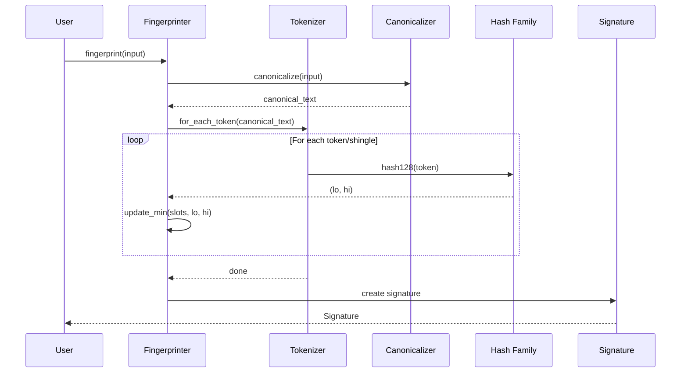

---

## Core Algorithms in Detail

### 1. MinHash (Jaccard Similarity)

#### Algorithm Overview

MinHash uses the **double-hashing construction** (Indyk-Motwani 1998 with Kirsch-Mitzenmacher refinement):

1. **Hash each shingle** with a 128-bit hash function (either MurmurHash3-x64-128 or xxh3-128)
2. **Derive H hash values** using the formula: `h_i = lo + i * hi` (where `lo, hi` are the two 64-bit halves)
3. **Store minimum** across all shingles for each of the H slots
4. **Compare signatures** by counting matching slots / H

#### Step-by-Step Process

```
Input: "the quick brown fox" (shingles: ["the quick", "quick brown", "brown fox"])

For each shingle:
    1. Compute 128-bit hash: (lo, hi) = hash128(shingle, seed)
    2. For each slot i in 0..H:
         h_i = lo + i * hi
         slot[i] = min(slot[i], h_i)

Output: MinHashSig<H> with H minimum hash values
```

#### Key Properties

- **Probability of slot match = Jaccard similarity**: `Pr[slot_i matches] = J(a, b)`
- **Double-hashing**: O(n + H) per shingle instead of O(n × H)
- **Variance**: `stddev = sqrt(p(1-p)/H)` where p is true Jaccard
- **Memory**: Fixed size: `8 + 8*H` bytes (1032 bytes for H=128)

#### Hash Families

- **MurmurHash3_x64_128**: Reference implementation, matches Python `datasketch`
- **Xxh3_64**: ~3× faster on modern cores, different hash values

**Mermaid Diagram - MinHash Fingerprinter Pipeline:**

**Explanation:** This diagram shows the complete MinHash fingerprint generation process:

1. **Input Processing:**
   - Text canonicalized (NFKC + casefold + bidi/format strip + optional confusable)
   - Tokenized with inner tokenizer (e.g., WordTokenizer)
   - ShingleTokenizer wraps tokens into k-grams

2. **MinHash Fingerprinter:**
   - Initializes H slots to ∞ (u64::MAX)
   - For each shingle:
     - Computes 128-bit hash via `hash128()` using configured HashFamily and seed
     - Returns (lo, hi) - two 64-bit halves
     - For each slot i: computes h_i = lo + (i × hi) with wrapping arithmetic
     - Updates slot[i] = min(slot[i], h_i)
   - After all shingles: slots contain minimum hash value seen per position

3. **Output:**
   - MinHashSig<H> struct with schema version, padding, and H minimum hash values
   - Signature can be compared via jaccard() to estimate Jaccard similarity

Key optimization: Double-hashing computes H hash values from 1 hash call per shingle, reducing O(n×H) to O(n+H).

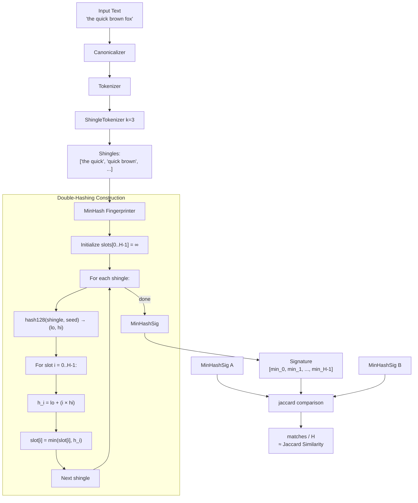

**Mermaid Diagram - MinHash Signature Structure:**

**Explanation:** This diagram shows the memory layout of MinHashSig<H>:

1. **Memory Layout (bytemuck::Pod compatible):**
   - `schema`: u16 - schema version number (currently 1)
   - `_pad`: [u8; 6] - zero padding for alignment
   - `hashes`: [u64; H] - H minimum hash values

2. **Total Size:** 2 + 6 + (8 × H) = 8 + 8H bytes
   - H=64: 520 bytes
   - H=128: 1032 bytes
   - H=256: 2056 bytes

3. **Properties:**
   - `bytemuck::Pod`: Allows zero-copy serialization via cast_slice
   - `Copy`: Signature can be copied cheaply
   - `PartialEq`: Signatures can be compared directly
   - `Hash`: Can be used in HashMap/HashSet (though jaccard() is the intended comparison)

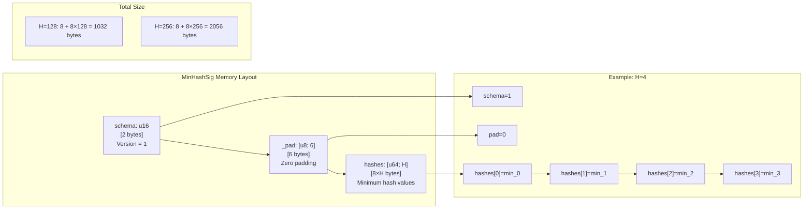

**MinHash S-Curve (Probability of Slot Match vs Jaccard):**

**Explanation:** This graph illustrates the fundamental MinHash property that probability of a slot match equals Jaccard similarity:

1. **Theoretical Foundation:**
   - For random permutation π of the universal set, Pr[min π(S) = min π(T)] = J(S, T)
   - Double-hashing approximates this with deterministic hash functions

2. **Variance Analysis:**
   - Each slot is an independent Bernoulli trial with p = Jaccard
   - Variance per slot = p(1-p)
   - Total variance = p(1-p)/H (decreases with more slots)
   - Standard deviation at p=0.5: ±0.044 for H=128

3. **Practical Implications:**
   - With H=128, estimate is within ±0.1 of true Jaccard ~95% of the time
   - Larger H reduces variance but increases memory
   - Typical trade-off: H=128 for general-purpose deduplication

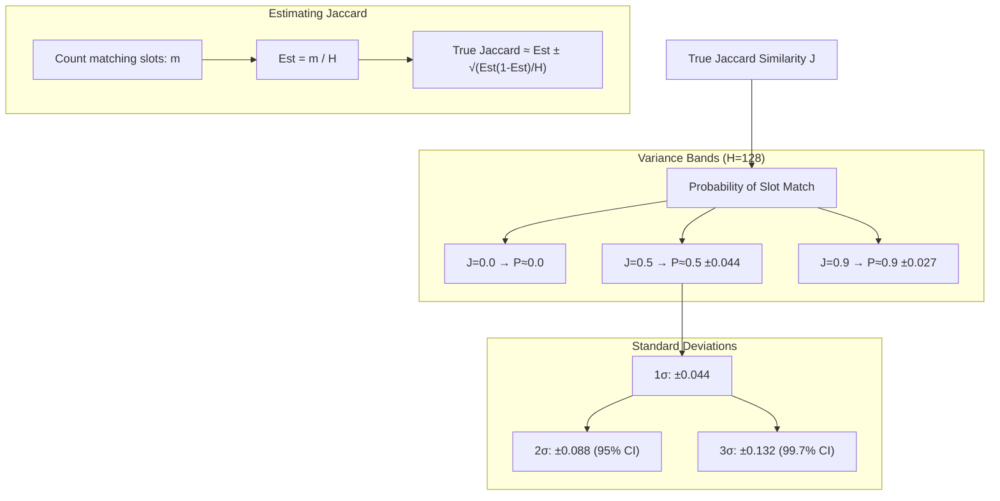

### 2. SimHash (Cosine Similarity)

#### Algorithm Overview

SimHash projects a weighted token bag onto 64 bits using the Charikar 2002 rounding technique:

1. **Initialize** 64 accumulator slots at 0
2. **For each token**: hash to 64 bits, add/subtract weight based on bit value
3. **Output**: bit i = 1 if accumulator[i] > 0, else 0

#### Step-by-Step Process

```
Input: "the quick brown" with Weighting::Tf

Initialize: acc[0..63] = 0

For each token "the":
    1. Hash to 64 bits: h = hash128("the", seed)
    2. For each bit i:
         if (h >> i) & 1 == 1:  acc[i] += 1
         else:                  acc[i] -= 1
    (repeat for each occurrence)

For each bit i:
    output_bit[i] = 1 if acc[i] > 0 else 0
```

#### Weighting Strategies

- **Uniform**: Each distinct token contributes ±1 (ignores frequency)
- **Tf**: Each occurrence contributes ±1 (linear in frequency)
- **IdfWeighted**: Weight = TF × IDF, requires external IDF table

#### Comparison Methods

- **Hamming distance**: `popcnt(a ^ b)` - hardware POPCNT, effectively free
- **Cosine estimate**: `cos((hamming_distance / 64) * π)` - maps to [-1, 1]

#### SimHash Dry Run

**Input:** `"the the fox"` with Weighting::Tf, H=64 (simplified to 8 for diagram)

**Pipeline:**

```
1. CANONICALIZE:
   Input:  "the the fox"
   Output: "the the fox"

2. TOKENIZE (WordTokenizer):
   Tokens: ["the", "the", "fox"]
   (each token appears in document order)

3. FINGERPRINT (sketch_canonical with Tf weighting):
   
   Initialize: acc = [0, 0, 0, 0, 0, 0, 0, 0]  (64 slots shown as 8 for diagram)
   
   Token "the" (1st occurrence):
   - hash128("the", seed) = 0xF0F0_0000_0F0F_0F0F
   - Bit 0: 1 → acc[0] += 1  → 1
   - Bit 1: 1 → acc[1] += 1  → 1
   - Bit 2: 1 → acc[2] += 1  → 1
   - Bit 3: 0 → acc[3] -= 1  → -1
   - ... (all 64 bits processed)
   
   Token "the" (2nd occurrence):
   - Same hash, add/subtract again
   - Bit 0: acc[0] += 1  → 2
   - Bit 1: acc[1] += 1  → 2
   - Bit 2: acc[2] += 1  → 2
   - Bit 3: acc[3] -= 1  → -2
   - ...
   
   Token "fox":
   - hash128("fox", seed) = 0x1234_5678_9ABC_DEF0
   - Add/subtract based on each bit
   
   Final accumulator after all tokens:
   acc = [4, 4, 4, -4, 2, 0, 0, -2]  (example values)
   
   Output bits:
   - Bit 0: 4 > 0 → 1
   - Bit 1: 4 > 0 → 1
   - Bit 2: 4 > 0 → 1
   - Bit 3: -4 < 0 → 0
   - Bit 4: 2 > 0 → 1
   - Bit 5: 0 → 0
   - Bit 6: 0 → 0
   - Bit 7: -2 < 0 → 0
   
   Result: 0b00010111 → SimHash64(0x17)
```

**Example with Hamming Distance:**

```
Signature A: 0xF0F0_0F0F_F0F0_F0F0
Signature B: 0xF0F0_0F0F_F0F1_F0F0

XOR:        0x0000_0000_0000_00F0
POPCNT:     4 bits differ

hamming(A, B) = 4
cosine_estimate = cos((4/64) * π) = cos(0.1963...) ≈ 0.98
```

**Mermaid Diagram - SimHash Pipeline:**

**Explanation:** This flowchart details the SimHash fingerprint generation with Tf (term frequency) weighting:

1. **Input Processing:**
   - Text canonicalized (NFKC + casefold + strip)
   - Tokenized with WordTokenizer → tokens in document order

2. **Tf Weighting Subgraph (Streaming):**
   - Each token **occurrence** adds/subtracts ±weight (not just per-distinct token)
   - This is the streaming hot path: no deduplication map needed
   - `hash128()` returns 128-bit hash, lower 64 bits (lo) used as the 64-bit fingerprint
   - For each of 64 bits: if bit is 1, add weight; if bit is 0, subtract weight
   - Weight defaults to 1.0 for Tf weighting

3. **Rounding:**
   - Final step: for each accumulator slot, output 1 if value > 0, else 0
   - This projects the 64-dimensional weighted sum onto a single 64-bit hash

4. **Comparison:**
   - Two SimHash64 signatures compared via XOR + POPCNT (hardware Hamming)
   - Cosine estimate maps Hamming distance to [-1, 1] range via `cos((dist/64) × π)`

The key insight is that **identical tokens appearing multiple times amplify** their contribution in Tf weighting, whereas Uniform weighting would count each distinct token only once.

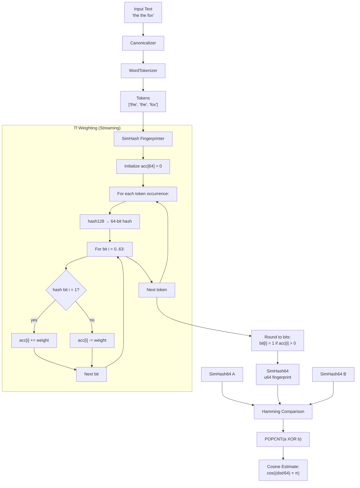

**Mermaid Diagram - accumulate_bits Function:**

**Explanation:** This is the inner loop of SimHash fingerprinting, implemented in `accumulate_bits()`:

1. **Input:** The 64-slot accumulator array, a 64-bit hash `lo`, and a weight `w`
2. **Loop:** Iterate over bit positions b = 0 to 63
3. **Decision:** Check if bit b of `lo` is set using `(lo >> b) & 1`
4. **Update:** If bit is 1, add weight to accumulator[b]; if 0, subtract weight
5. **Saturation:** Uses saturating arithmetic (`sat()`) to prevent overflow from adversarial inputs
6. **Return:** Modified accumulator with all 64 slots updated

The saturation is critical for security: without it, an attacker could craft inputs that overflow i64 bounds, causing undefined behavior. Saturating arithmetic clamps values at ±i64::MAX.

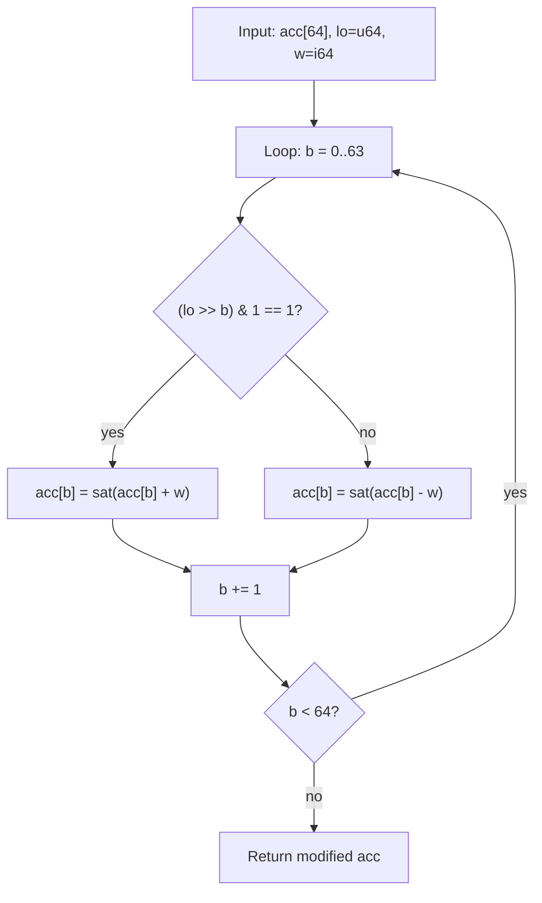

#### SimHash Probability Characteristics

| Hamming Distance | Cosine Estimate | Interpretation |
|------------------|-----------------|----------------|
| 0 | 1.0 | Identical |
| 8 | ~0.92 | Very similar |
| 16 | ~0.71 | Similar |
| 32 | 0.0 | Uncorrelated |
| 48 | ~-0.71 | Dissimilar |
| 64 | -1.0 | Opposite |

### 3. TLSH (Trend Micro LSH)

#### Algorithm Overview

TLSH operates on raw bytes with a trigram sliding window and quantized histogram:

1. **Trigram extraction**: Sliding 3-byte window over input
2. **Histogram quantization**: Bucket trigrams into body + checksum
3. **Distance calculation**: Header diff + body Hamming-style comparison

#### Key Properties

- **Input requirement**: Minimum 50 bytes after canonicalization
- **Output**: 70-character hex string (128/1 variant) or 134-character (256/3)
- **Distance**: Lower = more similar; <50 = high similarity, <100 = moderate

#### TLSH Dry Run

**Input:** `"the quick brown fox jumps over the lazy dog"` (56 bytes ≥ 50 byte minimum)

**Pipeline:**

```
1. CANONICALIZE:
   Input:  "the quick brown fox jumps over the lazy dog"
   Output: "the quick brown fox jumps over the lazy dog"

2. FINGERPRINT (sketch_bytes - TLSH operates on RAW BYTES):
   
   a. TRIGRAM SLIDING WINDOW:
      Bytes: [t, h, e, ' ', q, u, i, c, k, ...]
      
      Window 1: [t, h, e]     → hash bucket
      Window 2: [h, e, ' ']  → hash bucket
      Window 3: [e, ' ', q]   → hash bucket
      ... (sliding by 1 byte each step)
      
   b. HISTOGRAM QUANTIZATION:
      - 256 4-bit buckets (body): accumulate counts
      - Checksum bucket (accumulated checksum)
      - 2-component vector: [checksum_nibbles, body_histogram]
   
   c. SCORE COMPUTATION:
      - Map histogram to 256-byte feature vector
      - Compute checksum
      - Finalize: body(32 or 64 bytes) + checksum(1 or 3 bytes)
   
   Output: "T1F2A4B8C0D1E2F3A4B5C6D7E8F9A0B1C2D3E4F5..."

3. COMPARE (tlsh_distance):
   
   - Parse both hex strings to Tlsh128_1
   - Compute difference using tlsh2 crate's diff algorithm:
     diff = header_diff + body_hamming
   - Return lower i32 (0 = identical, higher = more different)
```

**Example TLSH Distance:**

```
Fingerprint A: "T1F2A4B8C0D1E2F3A4B5C6D7E8F9A0B1C2D3E4F5..."
Fingerprint B: "T1F2A4B8C0D1E2F3A4B5C6D7E8F9A0B1C2D3E4F5..."  (same)

tlsh_distance(A, B) = 0  (identical)

Fingerprint A: "T1F2A4B8C0D1E2F3A4B5C6D7E8F9A0B1C2D3E4F5..."
Fingerprint C: "T1F2A4B8C0D1E2F3A4B5C6D7E8F9A1B2C3D4E5F6..."  (one byte different)

tlsh_distance(A, C) = 156  (moderate difference)
```

**Mermaid Diagram - TLSH Pipeline:**

**Explanation:** TLSH (Trend Micro Locality-Sensitive Hash) processes raw bytes rather than tokens, using a trigram sliding window approach:

1. **Input Requirement:** Text must be ≥ 50 bytes after canonicalization (minimum entropy requirement)

2. **Trigram Sliding Window Subgraph:**
   - A 3-byte window slides one byte at a time across the input
   - For each position, the 3-byte sequence is hashed into one of 256 buckets
   - Each bucket stores a 4-bit counter (values 0-15, with overflow mapped)
   - Checksum is accumulated separately for the header

3. **Histogram Quantization:**
   - The 256 bucket counts form a histogram representing byte trigram frequency
   - Checksum nibbles capture global position/entropy information

4. **Finalization:**
   - Body (32 or 64 bytes) + checksum (1 or 3 bytes) → hex string
   - Prefixed with "T1" for 128/1 variant

5. **Distance Calculation Subgraph:**
   - Parses hex strings back to internal representation
   - Header difference: compares checksum components
   - Body difference: Hamming-style comparison of histogram values
   - Sum returned as distance score

Key difference from MinHash/SimHash: TLSH operates on **raw bytes** and builds its own internal structure (trigram histogram), bypassing the tokenizer entirely.

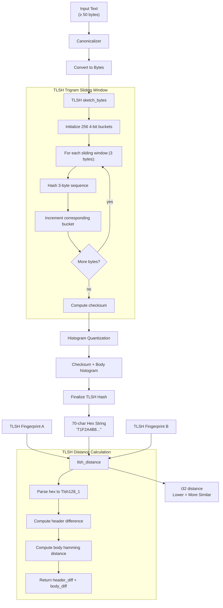

**TLSH Distance Thresholds:**

| Distance Range | Similarity Level | Use Case |
|----------------|------------------|----------|
| 0 | Identical | Exact duplicate |
| 1-50 | High | Near-duplicate |
| 51-100 | Moderate | Related content |
| 101-200 | Low | Different content |
| 200+ | Very Low | Unrelated |

### 4. Banded LSH (Locality-Sensitive Hashing)

#### Algorithm Overview

LSH collapses O(N) similarity search to O(1) by partitioning signatures into bands:

1. **Partition**: Split H slots into b bands of r rows each (b × r = H)
2. **Hash each band**: Concatenate r slots, hash to 64-bit bucket key
3. **Index**: Store document IDs in each band's bucket
4. **Query**: Probe each band, union candidates, optionally verify with exact Jaccard

**TLSH Distance Thresholds:**

| Distance Range | Similarity Level | Use Case |
|----------------|------------------|----------|
| 0 | Identical | Exact duplicate |
| 1-50 | High | Near-duplicate |
| 51-100 | Moderate | Related content |
| 101-200 | Low | Different content |
| 200+ | Very Low | Unrelated |

### 4. Banded LSH (Locality-Sensitive Hashing)

#### Algorithm Overview

LSH collapses O(N) similarity search to O(1) by partitioning signatures into bands:

1. **Partition**: Split H slots into b bands of r rows each (b × r = H)
2. **Hash each band**: Concatenate r slots, hash to 64-bit bucket key
3. **Index**: Store document IDs in each band's bucket
4. **Query**: Probe each band, union candidates, optionally verify with exact Jaccard

#### Probability Analysis

```
P(collision in at least one band) = 1 - (1 - t^r)^b

where t = true Jaccard similarity, r = rows per band, b = number of bands
```

The S-curve has steep transition near threshold. Optimal (b, r) minimizes:
`∫[0,threshold] P(t) dt + ∫[threshold,1] (1-P(t)) dt`

#### Banded LSH Dry Run

**Setup:**
- MinHash with H=16 slots
- Bands: b=4, Rows per band: r=4 (since 4 × 4 = 16)

**Indexing two documents:**

```
Document A MinHashSig (H=16):
  hashes: [h0, h1, h2, h3, h4, h5, h6, h7, h8, h9, h10, h11, h12, h13, h14, h15]

Document B MinHashSig (H=16):
  hashes: [h0, h1, h2, h3, h8, h9, h10, h11, h12, h13, h14, h15, ...]
  (First 4 slots match, rest differ)

Step 1: Band Partitioning
  Band 0: rows 0-3   → [h0, h1, h2, h3]
  Band 1: rows 4-7   → [h4, h5, h6, h7]
  Band 2: rows 8-11  → [h8, h9, h10, h11]
  Band 3: rows 12-15 → [h12, h13, h14, h15]

Step 2: Hash Each Band to Bucket Key (xxh3_64)
  Band 0 key A = xxh3_64([h0, h1, h2, h3])
  Band 0 key B = xxh3_64([h0, h1, h2, h3])  ← SAME as A!
  
  Band 1 key A = xxh3_64([h4, h5, h6, h7])
  Band 1 key B = xxh3_64([h8, h9, h10, h11])  ← DIFFERENT
  
  Band 2 key A = xxh3_64([h8, h9, h10, h11])
  Band 2 key B = xxh3_64([h8, h9, h10, h11])  ← SAME as A!
  
  Band 3 key A = xxh3_64([h12, h13, h14, h15])
  Band 3 key B = xxh3_64([h12, h13, h14, h15])  ← SAME as A!

Step 3: Insert into Band Tables
  Band 0: key_A → [doc_A_id, doc_B_id]  (collision!)
  Band 1: key_A → [doc_A_id], key_B → [doc_B_id]
  Band 2: key_A → [doc_A_id, doc_B_id]  (collision!)
  Band 3: key_A → [doc_A_id, doc_B_id]  (collision!)

Step 4: Query with Document A
  - Probe Band 0 with key_A → returns [doc_A_id, doc_B_id]
  - Probe Band 1 with key_A → returns [doc_A_id]
  - Probe Band 2 with key_A → returns [doc_A_id, doc_B_id]
  - Probe Band 3 with key_A → returns [doc_A_id, doc_B_id]
  - Union: [doc_A_id, doc_B_id]  (B is candidate, has ≥1 band collision)
```

**Probability Calculation Example:**

```
For threshold t=0.7, b=16 bands, r=8 rows:
  P(match at t=0.7) = 1 - (1 - 0.7^8)^16
                    = 1 - (1 - 0.057648)^16
                    = 1 - (0.94235)^16
                    = 1 - 0.396
                    = 0.604  (60.4% chance of collision)

For t=0.9:
  P(match at t=0.9) = 1 - (1 - 0.9^8)^16
                    = 1 - (1 - 0.4305)^16
                    = 1 - (0.5695)^16
                    = 1 - 0.00046
                    = 0.9995  (99.95% collision probability)
```

**Mermaid Diagram - Banded LSH Index Structure:**

**Explanation:** This diagram shows the two-level structure of the Banded LSH index:

1. **LSH Index Subgraph:**
   - A MinHashSig<H> contains H=128 hash values in an array
   - These are partitioned into b=16 bands, each containing r=8 rows
   - Band 0 takes rows 0-7, Band 1 takes rows 8-15, etc.
   - Each band's row slice is concatenated and hashed with xxh3_64 to create a bucket key
   - Each band has its own HashMap: key → list of document IDs that share this bucket

2. **Query Flow Subgraph:**
   - To query, extract the same band slices from the query signature
   - Hash each slice to get bucket keys
   - Probe each band's hash table, collecting all candidate document IDs
   - Union all candidates (deduplicate)
   - Optionally verify each candidate by computing exact jaccard() and filtering below threshold

Key insight: Two signatures that share **even one band** collide in the index. For high similarity (t > threshold), multiple bands typically match, making recall high. For low similarity, collision probability drops exponentially with the number of bands.

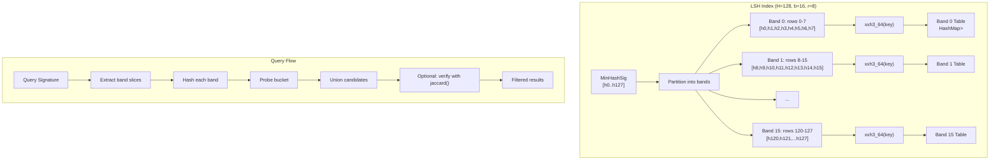

**Mermaid Diagram - Band/Row Optimization:**

**Explanation:** This diagram explains how `LshIndexBuilder::for_threshold()` selects optimal (b, r) parameters:

1. **Enumerate Factor Pairs:**
   - For given H, find all (b, r) such that b × r = H
   - Example: H=128 has pairs (1,128), (2,64), (4,32), (8,16), (16,8), (32,4), (64,2), (128,1)

2. **Compute Error Rates:**
   - False Positive (FP) rate: integral of collision probability from t=0 to t=threshold
   - False Negative (FN) rate: integral of (1 - collision probability) from t=threshold to t=1
   - Total Error = FP + FN (weighted equally by default)

3. **Pick Minimum:**
   - Choose the (b, r) pair with lowest combined error
   - Example shows b=16, r=8 is optimal for threshold=0.7 with H=128

Trade-off: More bands (higher b) with fewer rows (lower r) gives higher recall but more false positives. Fewer bands with more rows gives higher precision but may miss near-duplicates.

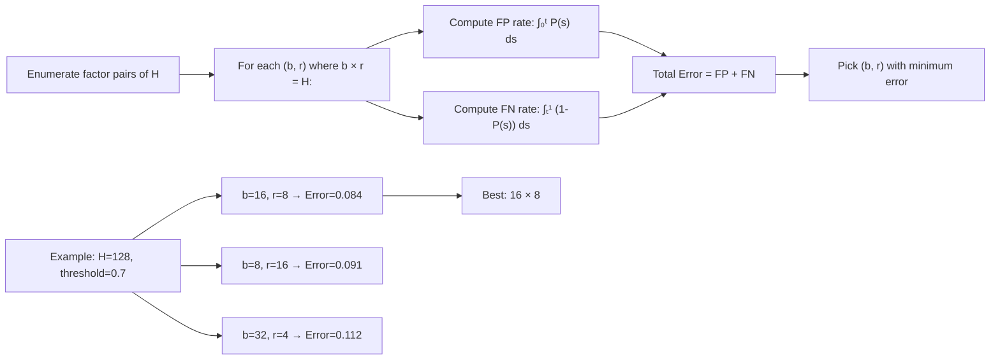

**LSH S-Curve Visualization:**

**Explanation:** This graph shows how the collision probability P changes with true Jaccard similarity t:

1. **P(collision) = 1 - (1 - t^r)^b:**
   - When t=0 (disjoint sets): P ≈ 0 (no collision)
   - When t=1 (identical sets): P = 1 (always collide)
   - Between 0 and 1, probability increases as an S-curve

2. **S-Curve Behavior:**
   - At low t: probability near zero (dissimilar docs don't collide)
   - At threshold: probability ~0.5 (transition zone)
   - At high t: probability near one (similar docs collide)

3. **Practical Interpretation:**
   - The steepness of the S-curve determines how sharply the LSH separates similar from dissimilar
   - With b=16, r=8 for threshold=0.7: docs with t<0.5 almost never collide, docs with t>0.9 almost always collide
   - This enables sub-linear retrieval: O(1) query instead of O(N) brute-force comparison

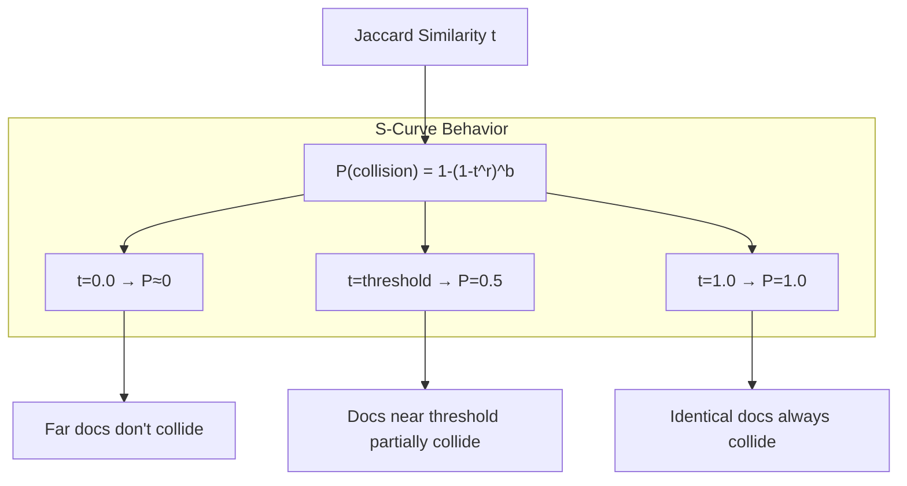
    
    C --> F["Far docs don't collide"]
    D --> G["Docs near threshold partially collide"]
    E --> H["Identical docs always collide"]
```

---

## Data Structures

### MinHashSig<H>

```rust
#[repr(C)]
pub struct MinHashSig<const H: usize> {
    pub schema: u16,      // Schema version (= 1)
    pub _pad: [u8; 6],    // Zero padding for alignment
    pub hashes: [u64; H], // H minimum hash values
}
```

**Size**: `8 + 8*H` bytes (1032 bytes for H=128)
**Properties**: `bytemuck::Pod`, `Copy`, `PartialEq`, `Hash`

### SimHash64

```rust
#[repr(transparent)]
pub struct SimHash64(pub u64);
```

**Size**: 8 bytes
**Properties**: `bytemuck::Pod`, `Copy`, `PartialEq`, `Hash`

### Embedding

```rust
pub struct Embedding {
    pub vector: Vec<f32>,           // n-dimensional vector
    pub model_id: Option<String>,  // Producer model identifier
}
```

**Validation**: Rejects empty vectors and non-finite values (NaN, ±Inf)

### FingerprintMetadata

```rust
pub struct FingerprintMetadata {
    pub algorithm: &'static str,    // "minhash-h128", "simhash-b64", etc.
    pub config_hash: u64,          // Hash of canonicalizer + tokenizer + algo config
    pub model_id: Option<String>,  // For embeddings only
    pub schema_version: u16,       // Per-algorithm schema
    pub byte_size: usize,          // Wire size of signature
}
```

---

## Parsing and Tokenization

### Tokenizer Trait

```rust
pub trait Tokenizer: Send + Sync {
    fn tokens<'a>(&'a self, input: &'a str) -> TokenStream<'a>;
    fn name(&self) -> Cow<'static, str>;
    fn for_each_token(&self, input: &str, f: &mut dyn FnMut(&str));
}
```

### WordTokenizer

- **Algorithm**: Unicode UAX #29 word boundaries
- **Behavior**: Filters out non-word segments (whitespace, punctuation)
- **Edge cases**: Contractions ("don't") are one token; CJK becomes individual tokens
- **Performance**: Zero-sized, zero-allocation in hot path

### GraphemeTokenizer

- **Algorithm**: Unicode UAX #29 extended grapheme clusters
- **Behavior**: Every user-perceived character is one token
- **Edge cases**:
  - Flag emoji `🇺🇸` = 1 token (regional indicator pair)
  - Family emoji `👨‍👩‍👧‍👦` = 1 token (ZWJ sequence)
  - `é` = 1 token (precomposed or combining sequence)

### ShingleTokenizer<T>

- **Algorithm**: Overlapping k-gram windows over inner tokenizer
- **Behavior**: Joins k consecutive tokens with single ASCII space
- **Edge cases**:
  - k=0 returns empty stream
  - Fewer than k tokens → single shingle of all tokens (datasketch convention)

#### Shingling Dry Run

**Input:** `"the quick brown fox"` with k=3 over WordTokenizer

**Step-by-step process:**

```
1. TOKENIZATION:
   WordTokenizer produces: ["the", "quick", "brown", "fox"]
   Token count: n = 4

2. SHINGLE WINDOW (k=3):
   Window positions: 0 to (n - k) = 0 to 1
   Total windows: (4 - 3 + 1) = 2 windows

   Window 0 (i=0): tokens[0..3] = ["the", "quick", "brown"]
                   Join with " " → "the quick brown"

   Window 1 (i=1): tokens[1..4] = ["quick", "brown", "fox"]
                   Join with " " → "quick brown fox"

3. OUTPUT:
   shingles = ["the quick brown", "quick brown fox"]
```

**Edge Case: k > n**

```
Input: "a b" (only 2 tokens)
k = 5 (requested)

Since n < k (2 < 5):
  - Single shingle containing ALL tokens
  - Result: ["a b"]
```

**Edge Case: k = 0**

```
k = 0 → Empty stream (no shingles produced)
```

**Mermaid Diagram - Shingling Process:**

**Explanation:** This diagram shows how ShingleTokenizer generates k-grams from a token stream, with two implementation paths:

1. **for_each_token Hot Path (zero-allocation):**
   - Inner tokenizer emits tokens
   - All tokens concatenated into single `flat` string (e.g., `"thequickbrownfox"`)
   - Byte ranges recorded for each token's start/end positions
   - For each window position i=0..=(n-k):
     - Extract ranges[i..i+k] from flat string
     - Join with single ASCII space in reusable buffer
     - Callback with shingle string
   - Result: shingles without intermediate String allocations per token

2. **tokens() Path (owned):**
   - Materializes inner tokens to `Vec<String>`
   - If `len < k`: returns single shingle joining all tokens
   - Otherwise: iterates windows, joining each slice with space
   - Produces `TokenStream::Owned` for API compatibility

The hot path optimization is critical for performance: instead of allocating a new String for each shingle (which would be O(n×k) allocations), it reuses a single buffer.

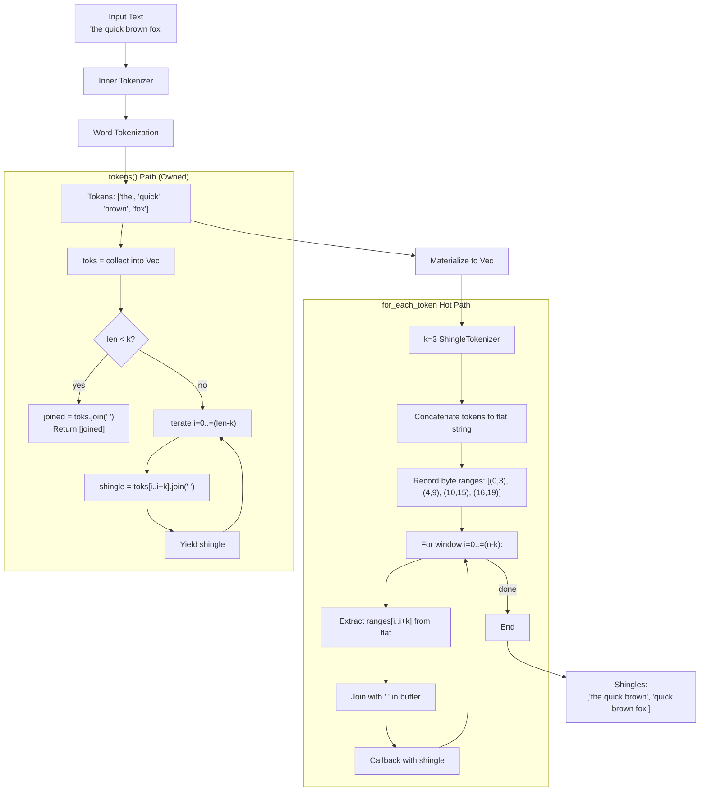

**Shingling with Different k Values:**

**Explanation:** This diagram shows how the number of output shingles varies with k:

- **k=1:** Each token is its own shingle. No joining, same as inner tokenizer.
- **k=2:** Adjacent pairs: "a b", "b c", "c d" (3 shingles from 4 tokens)
- **k=3:** Adjacent triples: "a b c", "b c d" (2 shingles from 4 tokens)
- **k=4:** Single shingle containing all tokens: "a b c d"
- **k=5 (>n):** Still single shingle (edge case: returns all tokens joined)

Formula: Number of shingles = max(1, n - k + 1) for n tokens, but returns 1 if n < k.

Trade-offs:
- **Smaller k:** More shingles, higher recall, more memory
- **Larger k:** Fewer shingles, more precision, better for near-duplicate detection
- **k=5** is standard for English document deduplication (balances precision/recall)

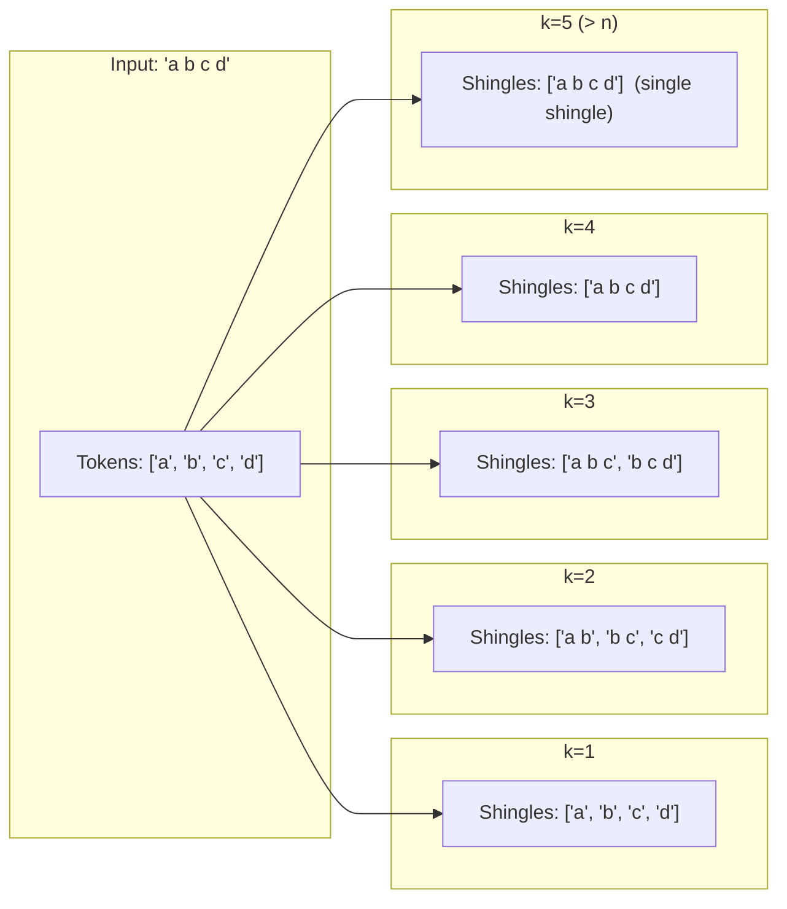

### CjkTokenizer

### CjkTokenizer

- **Segmenters**: 
  - `Jieba` - Simplified Chinese (default)
  - `Lindera` - Japanese (IPADIC) or Korean (ko-dic)
- **Dictionary loading**: OnceLock singleton, loaded on first use

---

## Evaluation and Similarity Metrics

### MinHash: jaccard()

```rust
pub fn jaccard<const H: usize>(a: &MinHashSig<H>, b: &MinHashSig<H>) -> f32
```

- **Algorithm**: Count matching slots / H
- **Implementation**: SIMD (wide crate) for 4 lanes at a time
- **Returns**: Fraction in [0.0, 1.0]
- **Variance**: sqrt(p(1-p)/H)

### SimHash: hamming()

```rust
pub fn hamming(a: SimHash64, b: SimHash64) -> u32
```

- **Algorithm**: `(a.0 ^ b.0).count_ones()`
- **Hardware**: POPCNT instruction on x86_64, `cnt` on AArch64
- **Returns**: 0-64

### SimHash: cosine_estimate()

```rust
pub fn cosine_estimate(a: SimHash64, b: SimHash64) -> f32
```

- **Algorithm**: `cos((hamming_distance / 64) * π)`
- **Returns**: [-1.0, 1.0]
- **Interpretation**: Charikar 2002 mapping from Hamming to cosine space

### TLSH: tlsh_distance()

```rust
pub fn tlsh_distance(a: &TlshFingerprint, b: &TlshFingerprint) -> Result<i32>
```

- **Algorithm**: TLSH body difference + header difference
- **Interpretation**: Lower = more similar; <50 = high, <100 = moderate

### Semantic: semantic_similarity()

```rust
pub fn semantic_similarity(a: &Embedding, b: &Embedding) -> Result<f32>
```

- **Algorithm**: `dot(a, b) / (||a|| * ||b||)`
- **Preconditions**: Same dimension, same model_id (if both specified)
- **Returns**: [-1.0, 1.0]

---

## Edge Cases

### Canonicalization

1. **Empty input**: Returns empty string
2. **Idempotency**: `canonicalize(canonicalize(x)) == canonicalize(x)` (proved with fuzzer)
3. **Expanding casefolds**: `İ` (U+0130) expands to `i` + combining dot above; re-normalizes to maintain ordering
4. **Bidi between combining marks**: Pre-normalization strip prevents reordering on second pass

### Fingerprinting

1. **Empty/whitespace-only input**: Returns `Error::InvalidInput("empty document")`
2. **UTF-8 split across chunks**: Streaming variant carries partial sequences, errors on trailing incomplete
3. **Buffer overflow**: Streaming limits to 16 MiB (configurable)
4. **TLSH minimum length**: Returns error if <50 bytes after canonicalization

### Tokenization

1. **Contractions**: "don't" = one token (UAX #29)
2. **CJK fallback**: No dictionary → per-codepoint tokens (UAX #29 behavior)
3. **Shingle k > tokens**: Returns single shingle with all tokens (datasketch convention)

### Comparison

1. **Model mismatch**: Semantic similarity returns error if model_id differs
2. **Dimension mismatch**: Returns error if embedding dimensions differ
3. **Schema version**: Signature with wrong schema rejected at deserialization

---

## File-by-File Breakdown

### src/lib.rs

- **Purpose**: Main library entry point, re-exports all public APIs
- **Key exports**: Canonicalizer, Tokenizer variants, Fingerprinter trait, MinHash/SimHash/TLSH, semantic module
- **Version constants**: `VERSION`, `FORMAT_VERSION`

### src/error.rs

- **Purpose**: Unified error type for all crate errors
- **Error variants**: InvalidInput, ModelMismatch, DimensionMismatch, Config, Io, Tokenizer, Onnx, Http, EmptyEmbedding, SchemaMismatch, FeatureDisabled
- **Result alias**: `pub type Result<T, E = Error>`

### src/fingerprint.rs

- **Purpose**: Unified Fingerprint enum + metadata
- **Key functions**: `config_hash()` (xxh3_64 of canonicalizer|tokenizer|algo config)
- **Fingerprint enum**: MinHash, SimHash, Tlsh, Embedding variants (feature-gated)
- **Metadata**: algorithm, config_hash, model_id, schema_version, byte_size

### src/canonical/mod.rs

- **Purpose**: Five-stage canonicalization pipeline
- **Stages**: decode → NFKC → strip Bidi/Cf → casefold → optional confusable
- **Fast paths**: Pure ASCII (single to_ascii_lowercase), ASCII + droppable format chars
- **Key functions**: `canonicalize()`, `config_string()`
- **Builder**: CanonicalizerBuilder with normalization, casefold, strip flags, confusable option

### src/canonical/bidi.rs

- **Purpose**: Bidi control and format category detection
- **Functions**: `is_bidi_control()`, `is_format()`
- **Covers**: LRE, RLE, PDF, LRO, RLO, LRI, RLI, FSI, PDI, LRM, RLM, ZWSP, BOM, variation selectors

### src/canonical/casefold.rs

- **Purpose**: Simple Unicode case fold via caseless crate
- **Function**: `simple()` - locale-independent, includes German ß → ss, Greek Σ → σ

### src/canonical/confusable.rs

- **Purpose**: UTS #39 confusable skeleton (security feature)
- **Function**: `skeleton()` - maps visually similar codepoints to common skeleton

### src/tokenize/mod.rs

- **Purpose**: Tokenizer trait and implementations
- **TokenStream enum**: Borrowed or Owned variants
- **Exports**: WordTokenizer, GraphemeTokenizer, ShingleTokenizer, CjkTokenizer

### src/tokenize/word.rs

- **Purpose**: UAX #29 word tokenizer
- **Implementation**: unicode_words() filter, zero-allocation for_each_token

### src/tokenize/grapheme.rs

- **Purpose**: UAX #29 grapheme cluster tokenizer
- **Implementation**: graphemes(true), handles ZWJ sequences, combining marks, flag emojis

### src/tokenize/shingle.rs

- **Purpose**: K-shingle adaptor
- **Implementation**: Buffer inner tokens, join contiguous windows with space
- **Edge case**: k > tokens → single shingle of all tokens
- **Optimization**: for_each_token uses single reused buffer + range table

### src/tokenize/cjk.rs

- **Purpose**: CJK segmentation
- **Segmenters**: Jieba (Simplified Chinese), Lindera (Japanese/Korean)
- **Lazy init**: OnceLock singleton for dictionary loading

### src/classical/mod.rs

- **Purpose**: Classical fingerprinters module
- **Traits**: Fingerprinter (offline), StreamingFingerprinter (chunked)
- **Exports**: HashFamily, minhash/simhash/lsh/tlsh submodules

### src/classical/hash.rs

- **Purpose**: Shared hash function implementations
- **MurmurHash3_x64_128**: Aappleby reference implementation, matches datasketch
- **Xxh3_64**: xxhash-rust xxh3, ~3× faster
- **Double-hashing**: `h_i = lo + i * hi` derives H slots from single 128-bit hash

### src/classical/minhash/sig.rs

- **Purpose**: MinHash signature type
- **Layout**: schema(2) + pad(6) + hashes(H*8)
- **bytemuck::Pod**: Zero-copy serialization via cast_slice

### src/classical/minhash/jaccard.rs

- **Purpose**: Jaccard similarity estimator
- **Implementation**: SIMD (wide crate) for 4 lanes, scalar tail
- **Algorithm**: matches / H

### src/classical/minhash/fingerprinter.rs

- **Purpose**: Offline MinHash fingerprinter
- **Key methods**: `fingerprint()`, `sketch_canonical()`, `with_seed()`, `with_hasher()`
- **Default seed**: 0x00C0_FFEE_5EED, default hasher: Xxh3_64

### src/classical/minhash/streaming.rs

- **Purpose**: Streaming MinHash fingerprinter
- **Implementation**: Buffers UTF-8, carries partial sequences, 16 MiB cap
- **Error cases**: Empty, trailing incomplete UTF-8, buffer exceeded

### src/classical/simhash/sig.rs

- **Purpose**: SimHash 64-bit signature
- **Layout**: repr(transparent) over u64, bytemuck::Pod

### src/classical/simhash/distance.rs

- **Purpose**: SimHash comparison functions
- **hamming()**: POPCNT of XOR
- **cosine_estimate()**: cos((distance/64) * π)

### src/classical/simhash/fingerprinter.rs

- **Purpose**: SimHash fingerprinter with weighting options
- **Weighting**: Uniform, Tf, IdfWeighted
- **Optimization**: Tf streams directly into accumulator, no dedup map
- **IdfTable**: Caller-supplied IDF lookup, fallback to 1.0 for unknown tokens

### src/classical/simhash/streaming.rs

- **Purpose**: Streaming SimHash (same pattern as MinHash streaming)

### src/classical/lsh/builder.rs

- **Purpose**: LSH index builder
- **Key method**: `for_threshold(t, h)` - numerical integration to pick optimal (bands, rows)
- **Algorithm**: 200-point trapezoidal quadrature, minimizes FP + FN rate sum

### src/classical/lsh/index.rs

- **Purpose**: Banded LSH index implementation
- **Data structures**: b band tables (HashMap<u64, SmallVec>) + reverse map
- **Identity hasher**: Keys are already xxh3_64, re-hashing is overhead
- **Query methods**: `query()` (candidates), `query_with_threshold()` (verified)
- **Parallel insert**: `extend_par()` shards by band across rayon pool

### src/classical/tlsh.rs

- **Purpose**: TLSH wrapper
- **Skipping canonicalizer**: `sketch_bytes()` for raw input
- **Distance**: `tlsh_distance()` computes body + header difference
- **Minimum input**: 50 bytes

### src/semantic/embedding.rs

- **Purpose**: Embedding vector type
- **Validation**: Rejects empty, NaN, Inf
- **Methods**: `dot()`, `normalize()`, `l2_norm()`
- **Compatibility**: Field-layout matches imgfprint::Embedding

### src/semantic/provider.rs

- **Purpose**: EmbeddingProvider trait + semantic_similarity
- **Trait methods**: embed(), model_id(), dimension()
- **semantic_similarity()**: Cosine similarity with model/dimension guards

### src/semantic/local.rs

- **Purpose**: Local ONNX embedding provider
- **Model loading**: HuggingFace Hub or explicit paths
- **Pooling**: Built-in table for BGE (Cls), E5 (Mean), others default to Mean
- **Prefixes**: Query/document prefixes for asymmetric models (BGE, E5)
- **Inference**: Serialized behind mutex, tokenize → run → pool

### src/semantic/pooling.rs

- **Purpose**: Pooling strategies for hidden states
- **Variants**: Cls, Mean, Max
- **Application**: Reduces [batch, seq, hidden] to [batch, hidden]

### src/semantic/chunk.rs

- **Purpose**: Long text chunking for embedding models
- **Strategies**: Character count, token count
- **Models**: Looks up model-specific max sequence length

### src/semantic/providers/*.rs

- **Purpose**: Cloud provider implementations
- **Providers**: OpenAI, Voyage, Cohere
- **Feature-gated**: openai, voyage, cohere features

### src/markup/html.rs

- **Purpose**: HTML to plain text
- **Preprocessing**: Strips <script> and <style> before parsing
- **Library**: html2text crate
- **Width**: usize::MAX (no artificial wrapping)

### src/markup/markdown.rs

- **Purpose**: Markdown to plain text
- **Library**: pulldown-cmark
- **Options**: include_code_blocks, include_inline_code, break_to_space

### src/pdf.rs

- **Purpose**: PDF extraction
- **Safeguards**: Size cap (50 MiB), timeout (30s), NUL sanitization
- **Library**: pdf-extract

---

## Summary

txtfp provides a comprehensive text fingerprinting solution with:

1. **Multiple algorithms** for different similarity metrics (Jaccard, Cosine, TLSH distance)
2. **Modular architecture** allowing independent optimization of each pipeline stage
3. **Production-ready defaults** (NFKC + casefold + bidi strip, k=5 shingles, H=128)
4. **Security features** including Trojan Source defense and confusable skeleton
5. **Semantic embeddings** for neural similarity search
6. **Efficient indexing** via banded LSH for sub-linear retrieval

The codebase is thoroughly tested with property-based tests, golden file tests, and fuzzing harnesses, ensuring correctness and determinism across inputs.
