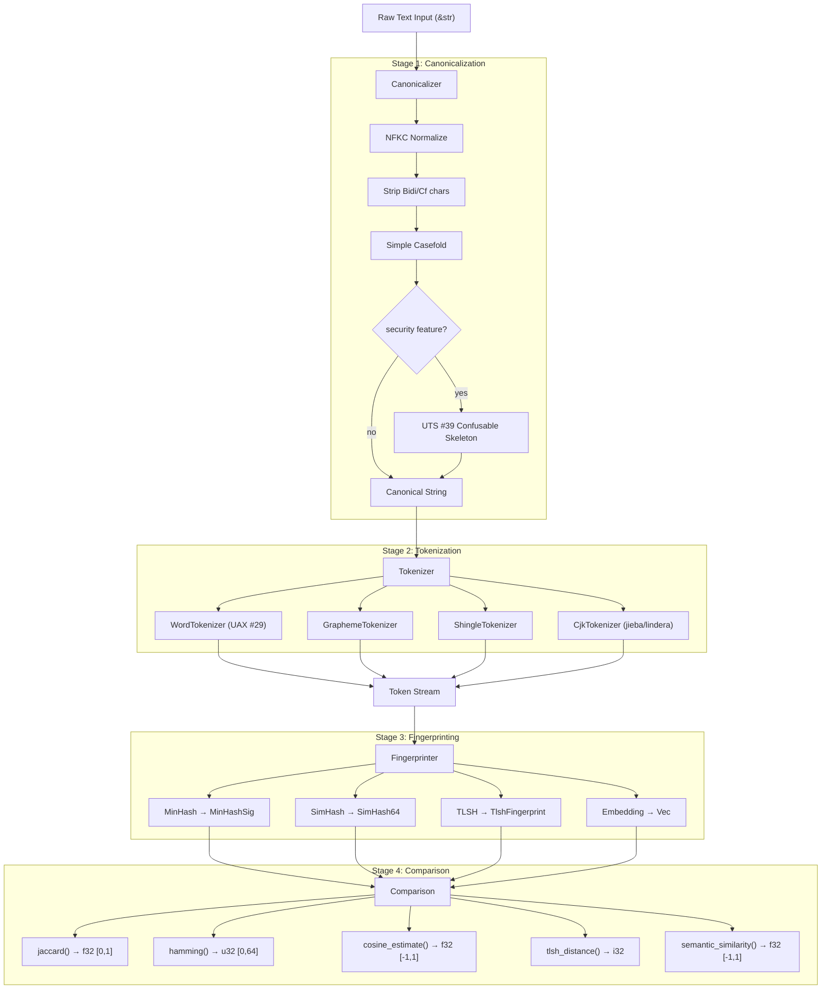
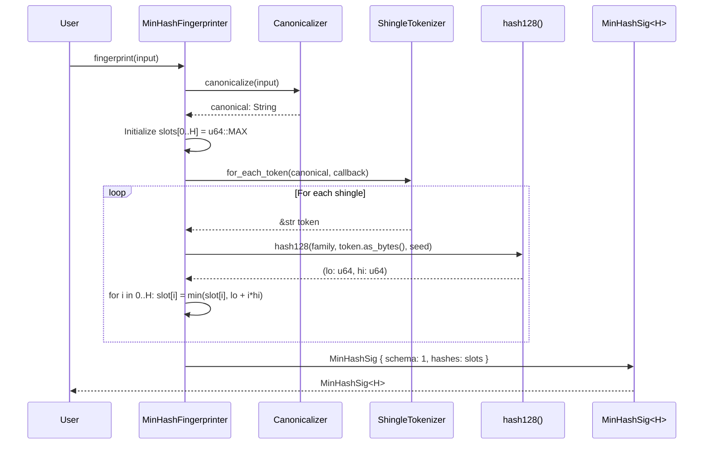
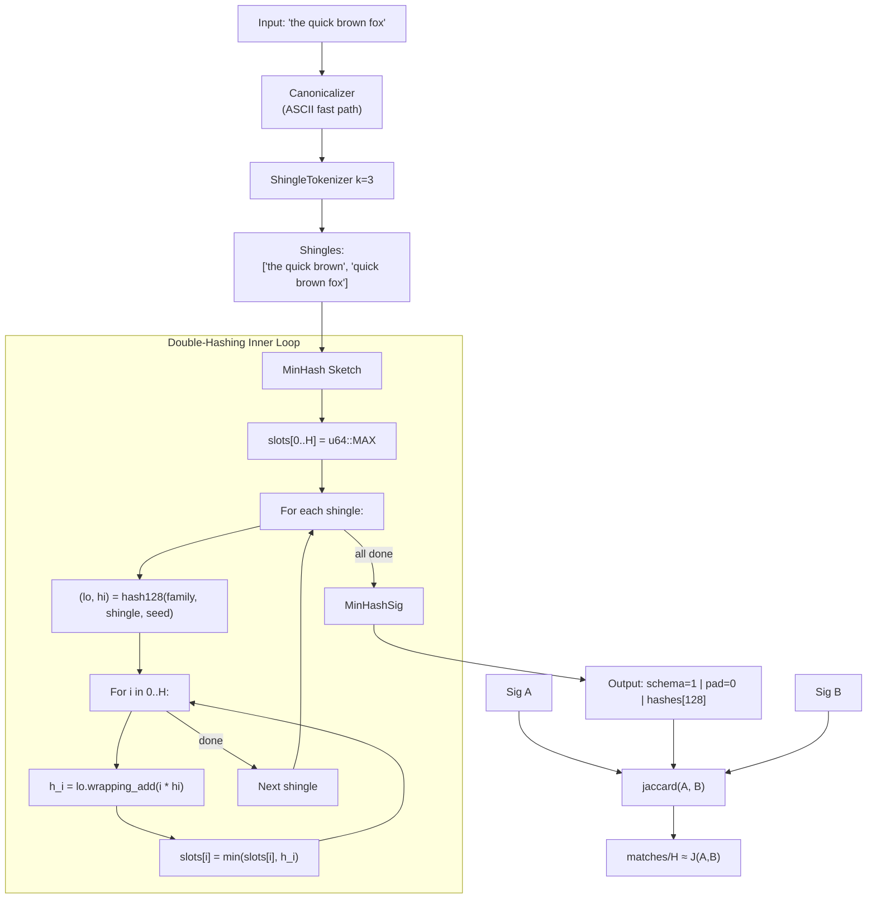
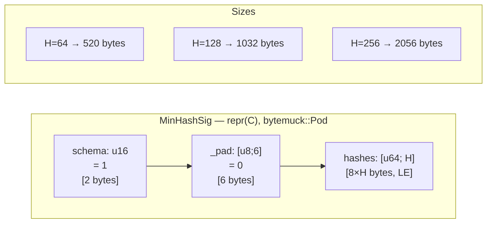
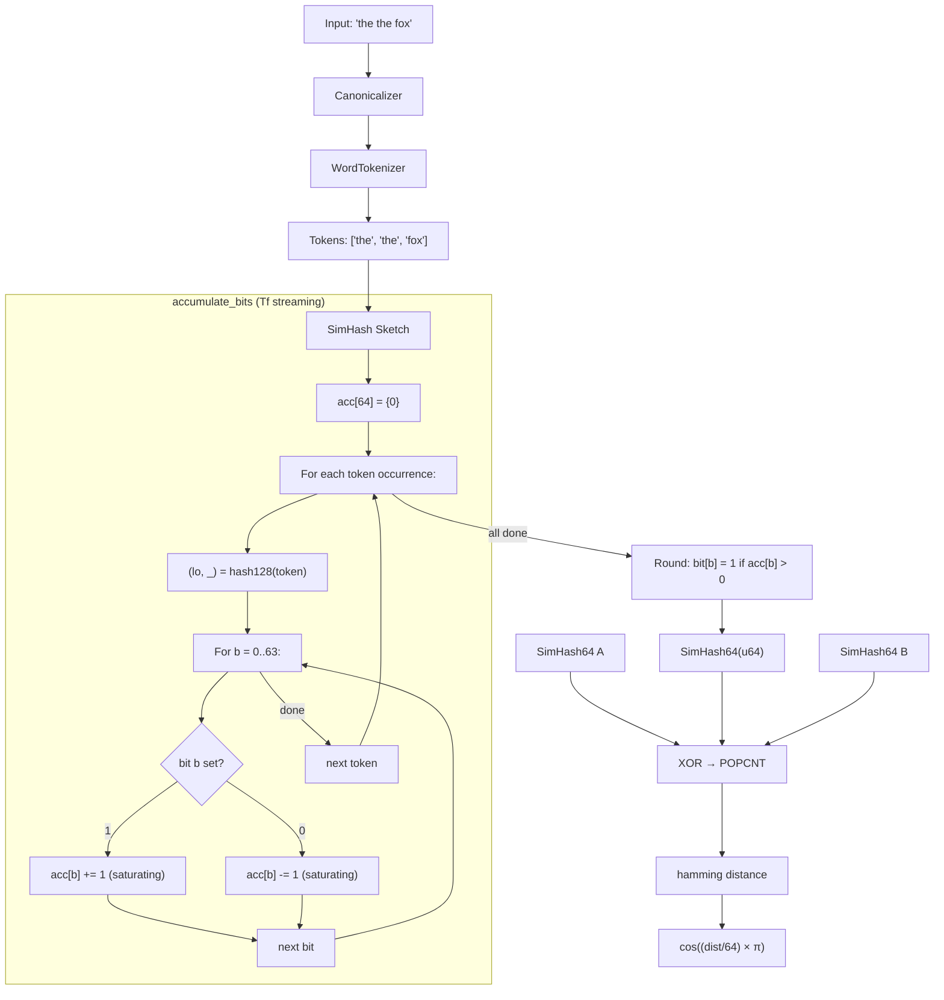
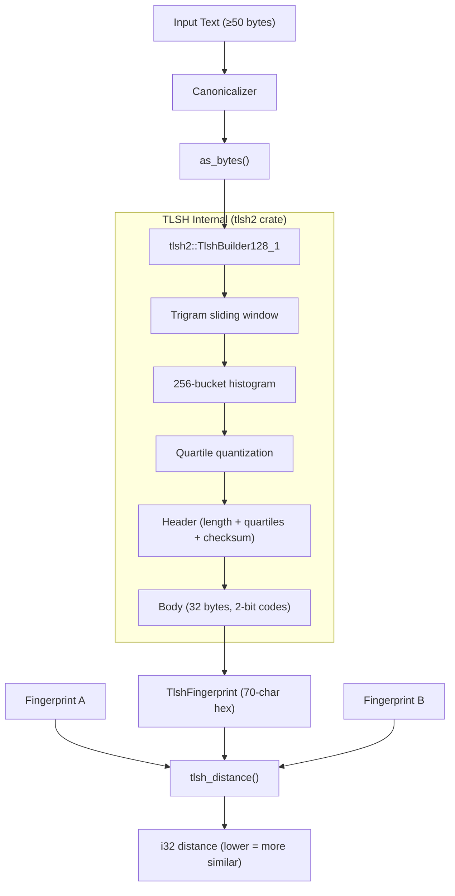
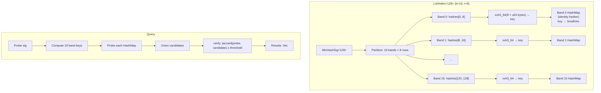
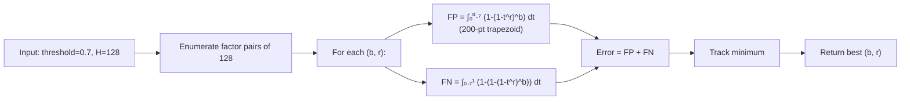
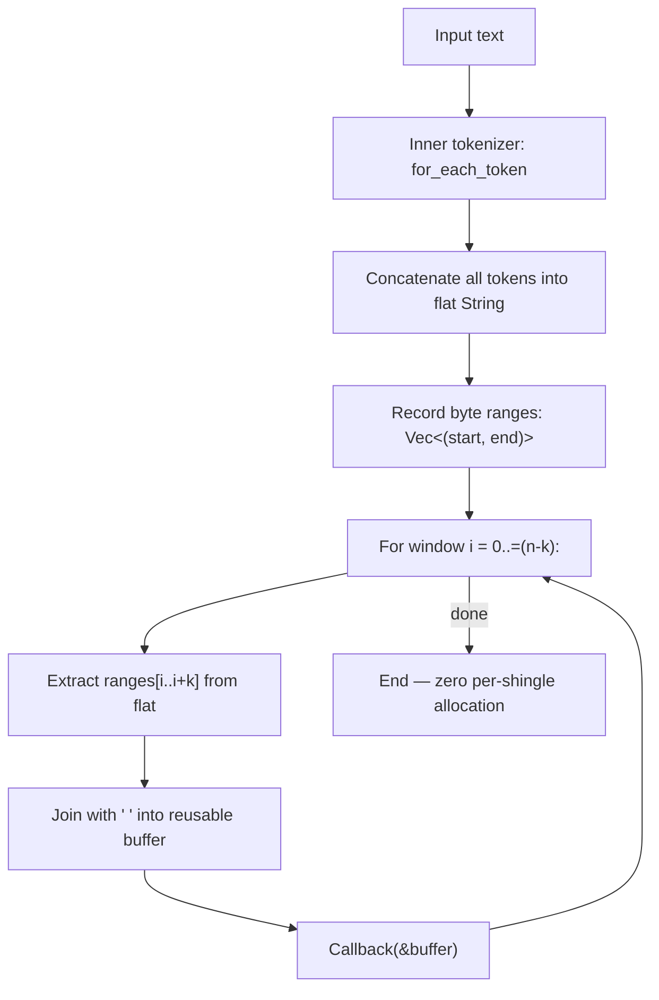

# txtfp — Internal Architecture & Algorithm Reference

> This document is the **internal** engineering reference for `txtfp`.
> It explains how every algorithm works at the bit level, how data flows
> through the pipeline, and how each module is organized. For the
> user-facing SDK guide, see [USAGE.md](USAGE.md).

---

## Table of Contents

1. [Project Overview](#project-overview)
2. [Architecture](#architecture)
3. [Core Algorithms](#core-algorithms)
   - [MinHash](#1-minhash-jaccard-similarity)
   - [SimHash](#2-simhash-cosine-similarity)
   - [TLSH](#3-tlsh-trend-micro-lsh)
   - [Banded LSH](#4-banded-lsh)
   - [Shingling](#5-shingling)
4. [Data Structures & Memory Layouts](#data-structures--memory-layouts)
5. [Tokenization Internals](#tokenization-internals)
6. [Similarity Metrics](#similarity-metrics)
7. [Edge Cases & Invariants](#edge-cases--invariants)
8. [Module Map](#module-map)

---

## Project Overview

**txtfp** is a Rust SDK (v0.2.2, edition 2024, MSRV 1.88) for extracting compact, deterministic, byte-stable fingerprints from text. It serves:

- LLM training-set deduplication
- RAG retrieval ranking
- Content moderation & plagiarism detection
- Email / document de-dup at scale

### Design Pillars

| Pillar | How |
|--------|-----|
| **Determinism** | Same input + same config → same bytes. No RNG, no clock. |
| **Byte stability** | `MinHashSig<H>` and `SimHash64` are `repr(C)` / `repr(transparent)` `bytemuck::Pod`. Golden tests enforce on every PR. |
| **Modularity** | Four-stage pipeline; each stage swappable via traits. |
| **Minimal footprint** | Default features compile `no_std + alloc` for WASM. Heavy deps (ONNX, CJK dicts) are opt-in. |
| **Cross-SDK parity** | `EmbeddingProvider`, `Embedding`, `semantic_similarity`, `FORMAT_VERSION` identical across `audiofp` / `imgfprint` / `txtfp`. |

---

## Architecture

### The Four-Stage Pipeline

Every fingerprint flows through four independent, composable stages:

```
input (&str)
    │
    ▼
┌─────────────────────────────────────────────────┐
│  Stage 1: Canonicalizer                         │
│  NFKC normalize → strip Bidi/Cf → casefold     │
│  → optional UTS #39 confusable skeleton         │
└─────────────────────────────────────────────────┘
    │
    ▼
┌─────────────────────────────────────────────────┐
│  Stage 2: Tokenizer                             │
│  Word (UAX #29) | Grapheme | Shingle | CJK     │
└─────────────────────────────────────────────────┘
    │
    ▼
┌─────────────────────────────────────────────────┐
│  Stage 3: Fingerprinter                         │
│  MinHash | SimHash | TLSH | Embedding           │
└─────────────────────────────────────────────────┘
    │
    ▼
┌─────────────────────────────────────────────────┐
│  Stage 4: Comparison                            │
│  jaccard | hamming | cosine_estimate            │
│  | tlsh_distance | semantic_similarity          │
└─────────────────────────────────────────────────┘
```

**Key principle**: Each stage is independently swappable. You can switch tokenizers without touching fingerprinters, change hash families without re-canonicalizing, or compare signatures produced by different pipeline configurations (guarded by `config_hash`).

### Pipeline Flow Diagram



### Runtime Sequence (MinHash path)



### Module Organization

```
src/
├── lib.rs                    # Re-exports, VERSION, FORMAT_VERSION
├── error.rs                  # Error enum (#[non_exhaustive]), Result alias
├── fingerprint.rs            # Fingerprint enum, FingerprintMetadata, config_hash
├── canonical/
│   ├── mod.rs                # Canonicalizer, CanonicalizerBuilder, fast paths
│   ├── bidi.rs               # is_bidi_control(), is_format()
│   ├── casefold.rs           # simple() via caseless crate
│   └── confusable.rs         # UTS #39 skeleton (security feature)
├── tokenize/
│   ├── mod.rs                # Tokenizer trait, TokenStream enum
│   ├── word.rs               # WordTokenizer (UAX #29)
│   ├── grapheme.rs           # GraphemeTokenizer (UAX #29 extended)
│   ├── shingle.rs            # ShingleTokenizer<T> (k-gram adaptor)
│   └── cjk.rs                # CjkTokenizer (jieba/lindera, OnceLock dict)
├── classical/
│   ├── mod.rs                # Fingerprinter + StreamingFingerprinter traits
│   ├── hash.rs               # HashFamily enum, hash128(), murmur3_x64_128()
│   ├── minhash/
│   │   ├── mod.rs            # Re-exports
│   │   ├── sig.rs            # MinHashSig<H> (repr(C), Pod)
│   │   ├── fingerprinter.rs  # MinHashFingerprinter, sketch_canonical()
│   │   ├── streaming.rs      # MinHashStreaming (16 MiB cap)
│   │   └── jaccard.rs        # jaccard() with SIMD (wide crate)
│   ├── simhash/
│   │   ├── mod.rs            # Re-exports
│   │   ├── sig.rs            # SimHash64 (repr(transparent), Pod)
│   │   ├── fingerprinter.rs  # SimHashFingerprinter, accumulate_bits()
│   │   ├── streaming.rs      # SimHashStreaming
│   │   └── distance.rs       # hamming(), cosine_estimate()
│   ├── lsh/
│   │   ├── mod.rs            # Re-exports
│   │   ├── builder.rs        # LshIndexBuilder, for_threshold(), quadrature
│   │   └── index.rs          # LshIndex<H>, band tables, identity hasher
│   └── tlsh.rs               # TlshFingerprinter, tlsh_distance(), MIN_INPUT_BYTES
├── semantic/
│   ├── mod.rs                # Re-exports
│   ├── embedding.rs          # Embedding struct, validation
│   ├── provider.rs           # EmbeddingProvider trait, semantic_similarity()
│   ├── local.rs              # LocalProvider (ort 2.0, HF Hub, pooling table)
│   ├── pooling.rs            # Pooling enum (Cls, Mean, MeanNoNorm, Max)
│   ├── chunk.rs              # ChunkingStrategy, chunk_for_model()
│   └── providers/
│       ├── mod.rs
│       ├── openai.rs         # OpenAiProvider
│       ├── voyage.rs         # VoyageProvider
│       ├── cohere.rs         # CohereProvider
│       └── retry.rs          # Shared exponential backoff + Retry-After
├── markup/
│   ├── mod.rs
│   ├── html.rs               # html_to_text (html2text, strips script/style)
│   └── markdown.rs           # markdown_to_text (pulldown-cmark)
└── pdf.rs                    # pdf_to_text (pdf-extract, 30s timeout, 50 MiB cap)
```


---

## Core Algorithms

### 1. MinHash (Jaccard Similarity)

#### Theory

MinHash estimates the Jaccard similarity `J(A, B) = |A ∩ B| / |A ∪ B|` between two sets by exploiting the property that for a random permutation π:

```
Pr[min π(A) = min π(B)] = J(A, B)
```

Instead of true random permutations (expensive), txtfp uses the **double-hashing construction** (Indyk–Motwani 1998, Kirsch–Mitzenmacher 2008):

1. Hash each token/shingle once with a 128-bit hash → `(lo, hi)`
2. Derive H virtual hash functions: `h_i = lo + i × hi` (wrapping u64 arithmetic)
3. Keep the minimum value seen per slot across all tokens

This reduces per-token cost from O(H) independent hashes to O(1) hash + O(H) additions.

#### Algorithm Walkthrough

```
INPUT: "the quick brown fox" with ShingleTokenizer{k=3, inner=WordTokenizer}
SEED:  0x00C0_FFEE_5EED
HASH:  HashFamily::Xxh3_64 (default v0.2.0+)
H:     128 slots

Step 1 — Canonicalize:
  "the quick brown fox" → "the quick brown fox" (ASCII fast path)

Step 2 — Tokenize (shingles, k=3):
  ["the quick brown", "quick brown fox"]

Step 3 — Sketch:
  Initialize: slots[0..128] = u64::MAX

  Shingle "the quick brown":
    (lo, hi) = xxh3_128("the quick brown", seed)
    For i = 0..128:
      h_i = lo.wrapping_add(i.wrapping_mul(hi))
      slots[i] = min(slots[i], h_i)

  Shingle "quick brown fox":
    (lo, hi) = xxh3_128("quick brown fox", seed)
    For i = 0..128:
      h_i = lo.wrapping_add(i.wrapping_mul(hi))
      slots[i] = min(slots[i], h_i)

Step 4 — Output:
  MinHashSig<128> { schema: 1, _pad: [0;6], hashes: slots }
```

#### Comparison: `jaccard(a, b)`

```
matches = count(i where a.hashes[i] == b.hashes[i])
jaccard_estimate = matches / H

Variance: σ² = p(1-p)/H where p = true Jaccard
For H=128, p=0.5: σ = 0.044 (95% CI: ±0.088)
```

#### Hash Families

| Family | Speed | Datasketch parity | Internal call |
|--------|-------|-------------------|---------------|
| `Xxh3_64` (default v0.2+) | ~3× faster | ✗ | `xxh3_128_with_seed` → split into (lo, hi) |
| `MurmurHash3_x64_128` | Reference | ✓ | `murmur3_x64_128(key, seed)` → (h1, h2) |

#### MinHash Pipeline Diagram



#### Memory Layout



#### Variance & Accuracy

```
True Jaccard (p)  |  σ (H=128)  |  95% CI width
─────────────────────────────────────────────────
     0.1          |   0.027     |   ±0.053
     0.3          |   0.041     |   ±0.080
     0.5          |   0.044     |   ±0.088
     0.7          |   0.041     |   ±0.080
     0.9          |   0.027     |   ±0.053
```

#### Key Properties

- **Permutation-invariant**: Token order doesn't matter (set semantics)
- **Duplicate-insensitive**: `min(x, x) = x` — repeated tokens don't change the signature
- **Sub-additive**: Adding tokens can only decrease slot values
- **Deterministic**: Same input + config → identical bytes


---

### 2. SimHash (Cosine Similarity)

#### Theory

SimHash (Charikar 2002) projects a weighted token bag into a single 64-bit hash such that the Hamming distance between two hashes approximates the angular distance between the original vectors:

```
cos(θ) ≈ cos((hamming(a, b) / 64) × π)
```

#### Algorithm Walkthrough

```
INPUT: "the the fox" with Weighting::Tf
SEED:  0x00C0_FFEE_5EED
HASH:  HashFamily::Xxh3_64

Step 1 — Canonicalize:
  "the the fox" → "the the fox"

Step 2 — Tokenize (WordTokenizer):
  Tokens in document order: ["the", "the", "fox"]

Step 3 — Sketch (Tf weighting — streaming hot path):
  Initialize: acc[0..64] = 0_i64

  Token "the" (1st occurrence):
    (lo, _hi) = hash128(Xxh3_64, b"the", seed)
    For bit b = 0..63:
      if (lo >> b) & 1 == 1: acc[b] += 1   (saturating)
      else:                  acc[b] -= 1   (saturating)

  Token "the" (2nd occurrence):
    Same hash → same bits → acc amplified again
    acc[b] += 1 or -= 1 for each bit

  Token "fox":
    (lo, _hi) = hash128(Xxh3_64, b"fox", seed)
    Different hash bits → different acc updates

Step 4 — Round to bits:
  result: u64 = 0
  For b = 0..63:
    if acc[b] > 0: result |= (1 << b)

  Output: SimHash64(result)
```

#### The `accumulate_bits` Inner Loop

This is the performance-critical function:

```rust
fn accumulate_bits(acc: &mut [i64; 64], lo: u64, w: i64) {
    for (b, slot) in acc.iter_mut().enumerate() {
        if (lo >> b) & 1 == 1 {
            *slot = slot.saturating_add(w);
        } else {
            *slot = slot.saturating_sub(w);
        }
    }
}
```

**Saturating arithmetic** prevents overflow from adversarial inputs. LLVM auto-vectorizes this loop on x86_64 (verified: `vpcmpltuq` + AVX-512 mask blending).

#### Weighting Strategies

| Strategy | Weight per token | Needs dedup map? | Hot path? |
|----------|-----------------|------------------|-----------|
| `Tf` (default) | ±1 per occurrence | No | ✓ Streaming |
| `Uniform` | ±1 per distinct token | Yes | ✗ |
| `IdfWeighted(table)` | ±(tf × idf) | Yes | ✗ |

**Tf streaming insight**: `+1+1+1` for a triplicate token is mathematically identical to `+3` after dedup. The streaming path avoids the HashMap entirely.

#### Comparison

```
hamming(a, b) = popcnt(a.0 ^ b.0)     // 0..=64, hardware POPCNT
cosine_estimate(a, b) = cos((hamming / 64) × π)   // [-1.0, 1.0]
```

| Hamming | Cosine | Interpretation |
|---------|--------|----------------|
| 0 | 1.0 | Identical |
| 8 | 0.92 | Very similar |
| 16 | 0.71 | Similar |
| 32 | 0.0 | Uncorrelated |
| 48 | -0.71 | Dissimilar |
| 64 | -1.0 | Opposite |

#### SimHash Pipeline Diagram




---

### 3. TLSH (Trend Micro LSH)

#### Theory

TLSH (Oliver et al. 2013) is a byte-level locality-sensitive hash. Unlike MinHash/SimHash which operate on tokenized text, TLSH processes **raw bytes** through a trigram sliding window and quantized histogram. It captures statistical features of the byte stream.

#### Algorithm Walkthrough

```
INPUT: "the quick brown fox jumps over the lazy dog" (44 bytes)
       (Must be ≥ 50 bytes after canonicalization — this example is simplified)
VARIANT: 128/1 (32-byte body + 1-byte checksum)

Step 1 — Canonicalize:
  "the quick brown fox..." → lowercase bytes

Step 2 — Convert to bytes and feed to tlsh2 crate:

  a. TRIGRAM SLIDING WINDOW:
     Bytes: [t, h, e, ' ', q, u, i, c, k, ...]
     
     Window 0: [t, h, e]    → hash → bucket index
     Window 1: [h, e, ' ']  → hash → bucket index
     Window 2: [e, ' ', q]  → hash → bucket index
     ... (n-2 windows for n bytes)

  b. HISTOGRAM:
     256 buckets accumulate trigram counts
     Checksum accumulated separately

  c. QUANTIZATION:
     Bucket counts → quartile boundaries → 2-bit codes per bucket
     Header: length, quartile ratios, checksum

  d. OUTPUT:
     70-char hex string: "T1" prefix + header + body
     e.g. "T1A12..." (128/1 variant)

Step 3 — Compare:
  tlsh_distance(A, B) = header_diff + body_diff
  Returns i32: lower = more similar
```

#### Distance Thresholds

| Distance | Similarity | Typical use |
|----------|-----------|-------------|
| 0 | Identical | Exact duplicate |
| 1–50 | High | Near-duplicate |
| 51–100 | Moderate | Related content |
| 101–200 | Low | Different content |
| 200+ | Very low | Unrelated |

#### TLSH Pipeline Diagram



#### Key Differences from MinHash/SimHash

- Operates on **raw bytes**, not tokens
- Bypasses the tokenizer entirely (uses `sketch_bytes()` internally)
- Minimum 50 bytes input requirement
- Distance metric (lower = better) vs similarity metric (higher = better)
- Wraps the `tlsh2` crate — txtfp doesn't reimplement the algorithm

---

### 4. Banded LSH

#### Theory

Banded LSH collapses O(N) brute-force similarity search to O(1) average-case by partitioning MinHash signatures into bands and hashing each band into buckets:

```
P(at least one band collision) = 1 - (1 - t^r)^b

where:
  t = true Jaccard similarity
  b = number of bands
  r = rows per band (b × r = H)
```

This produces an S-curve: documents above the threshold almost always collide; documents below almost never do.

#### Algorithm Walkthrough

```
SETUP: H=128, threshold=0.7
OPTIMIZATION: LshIndexBuilder::for_threshold(0.7, 128)
  → Enumerates factor pairs: (1,128), (2,64), (4,32), (8,16), (16,8), (32,4), (64,2), (128,1)
  → 200-point trapezoidal quadrature for each pair
  → Minimizes: ∫₀ᵗ P(s)ds + ∫ₜ¹ (1-P(s))ds
  → Picks optimal: b=16, r=8

INDEXING Document A (MinHashSig<128>):
  Band 0: hashes[0..8]   → xxh3_64(bytes) → bucket_key_0
  Band 1: hashes[8..16]  → xxh3_64(bytes) → bucket_key_1
  ...
  Band 15: hashes[120..128] → xxh3_64(bytes) → bucket_key_15

  Insert doc_id into each band's HashMap at the computed key.

QUERYING with probe signature:
  1. Compute 16 band keys from probe
  2. Probe each band's HashMap
  3. Union all candidate doc_ids (deduplicate)
  4. Optional: verify each candidate with exact jaccard()
  5. Return filtered results
```

#### Probability Examples

```
threshold=0.7, b=16, r=8:

  t=0.5: P = 1-(1-0.5⁸)¹⁶ = 1-(1-0.0039)¹⁶ = 0.061  (6% — good, low FP)
  t=0.7: P = 1-(1-0.7⁸)¹⁶ = 1-(1-0.0576)¹⁶ = 0.604  (60% — transition)
  t=0.9: P = 1-(1-0.9⁸)¹⁶ = 1-(1-0.4305)¹⁶ = 0.9995 (99.95% — high recall)
```

#### Band/Row Trade-offs (H=128)

| (bands, rows) | Sweet-spot threshold | Character |
|---------------|---------------------|-----------|
| (8, 16) | ~0.95 | Exact dedup only |
| (16, 8) | ~0.85 | Strict near-dup |
| (32, 4) | ~0.65 | Moderate fuzzy |
| (64, 2) | ~0.45 | High recall |

#### LSH Index Structure Diagram



#### `for_threshold` Optimization Diagram



#### Internal Data Structures

- **Band tables**: `Vec<HashMap<u64, SmallVec<[u64; 4]>>>` — one HashMap per band
- **Identity hasher**: Band keys are already xxh3_64 digests; re-hashing is waste
- **Reverse map**: `HashMap<u64, MinHashSig<H>>` — stores signatures for `query_with_threshold` verification
- **Parallel insert** (`extend_par`): Shards by band across rayon pool, contention-free


---

### 5. Shingling

#### Theory

Shingling converts a token stream into overlapping k-grams, preserving local word order. This is the standard input representation for MinHash-based document similarity.

#### Algorithm Walkthrough

```
INPUT: "the quick brown fox" with k=3, inner=WordTokenizer

Step 1 — Inner tokenization:
  WordTokenizer → ["the", "quick", "brown", "fox"]  (n=4 tokens)

Step 2 — Sliding window (k=3):
  Number of shingles = n - k + 1 = 4 - 3 + 1 = 2

  Window 0: tokens[0..3] = ["the", "quick", "brown"] → "the quick brown"
  Window 1: tokens[1..4] = ["quick", "brown", "fox"] → "quick brown fox"

Step 3 — Output:
  ["the quick brown", "quick brown fox"]
```

#### Edge Cases

```
k=0:  → empty stream (no shingles)
k=1:  → same as inner tokenizer (each token is its own shingle)
k > n (e.g., k=5, n=2 tokens "a b"):
      → single shingle: "a b" (datasketch convention)
```

#### `for_each_token` Hot Path (zero-allocation)



#### Shingle Count Formula

```
shingles(n, k) = max(1, n - k + 1)   if n ≥ 1
               = 0                     if n = 0

Special: if n < k and n ≥ 1 → returns 1 (all tokens joined)
```

---

## Data Structures & Memory Layouts

### MinHashSig<H>

```rust
#[repr(C)]
pub struct MinHashSig<const H: usize> {
    pub schema: u16,       // = 1 (frozen)
    pub _pad:   [u8; 6],   // = 0 (alignment)
    pub hashes: [u64; H],  // little-endian minimum hash values
}
// Total: 8 + 8*H bytes
// Properties: bytemuck::Pod, Copy, PartialEq, Eq, Hash
// Zero-copy: bytemuck::cast_slice(&[MinHashSig<H>]) → &[u8]
```

### SimHash64

```rust
#[repr(transparent)]
pub struct SimHash64(pub u64);
// Total: 8 bytes (little-endian)
// Properties: bytemuck::Pod, Copy, PartialEq, Eq, Hash
```

### TlshFingerprint

```rust
pub struct TlshFingerprint(pub String);
// 70-char hex string for 128/1 variant
// Not Pod — wraps the tlsh2 crate's output
```

### Embedding

```rust
pub struct Embedding {
    pub vector:   Vec<f32>,          // n-dimensional dense vector
    pub model_id: Option<String>,    // producer model identifier
}
// Validation: rejects empty, NaN, ±Inf at construction
// Methods: dot(), normalize(), l2_norm(), dim()
```

### FingerprintMetadata

```rust
pub struct FingerprintMetadata {
    pub algorithm:      &'static str,  // "minhash-h128", "simhash-b64", etc.
    pub config_hash:    u64,           // xxh3_64 of canonicalizer|tokenizer|algo
    pub model_id:       Option<String>,
    pub schema_version: u16,
    pub byte_size:      usize,
}
```

### Fingerprint (unified enum)

```rust
pub enum Fingerprint {
    MinHash(MinHashSig<128>),    // minhash feature
    SimHash(SimHash64),          // simhash feature
    Tlsh(TlshFingerprint),       // tlsh feature
    Embedding(Embedding),        // semantic feature
}
```

---

## Tokenization Internals

### Tokenizer Trait

```rust
pub trait Tokenizer: Send + Sync {
    fn tokens<'a>(&'a self, input: &'a str) -> TokenStream<'a>;
    fn name(&self) -> Cow<'static, str>;
    fn for_each_token(&self, input: &str, f: &mut dyn FnMut(&str));
}
```

Two paths:
- `tokens()` → `TokenStream` (iterator, may allocate)
- `for_each_token()` → callback (zero-allocation hot path, used by all classical sketchers)

### Implementations

| Tokenizer | Algorithm | Allocation | `name()` |
|-----------|-----------|------------|----------|
| `WordTokenizer` | UAX #29 word boundaries, filters non-word | Zero-sized, zero-alloc | `"word-uax29"` |
| `GraphemeTokenizer` | UAX #29 extended grapheme clusters | Zero-sized, zero-alloc | `"grapheme-uax29"` |
| `ShingleTokenizer<T>` | k-gram windows over inner T | Reusable buffer + range table | `"shingle-k=<k>/<inner>"` |
| `CjkTokenizer` | jieba-rs / lindera segmentation | OnceLock dictionary | `"cjk-jieba"` / `"cjk-lindera"` |

### Notable Behaviors

- **WordTokenizer**: "don't" = 1 token (UAX #29 MidLetter rule). Filters whitespace/punctuation.
- **GraphemeTokenizer**: `🇺🇸` = 1 token, `👨‍👩‍👧‍👦` = 1 token, `é` (combining) = 1 token. Yields everything including whitespace.
- **ShingleTokenizer**: k=0 → empty. k > n → single shingle of all tokens.
- **CjkTokenizer**: Dictionary loaded once via `OnceLock`. Falls back to per-codepoint on missing dict.

---

## Similarity Metrics

| Function | Input | Output | Algorithm | Hardware |
|----------|-------|--------|-----------|----------|
| `jaccard(a, b)` | `&MinHashSig<H>` × 2 | `f32 [0,1]` | matching slots / H | SIMD (wide crate, 4 lanes) |
| `hamming(a, b)` | `SimHash64` × 2 | `u32 [0,64]` | `popcnt(a ^ b)` | POPCNT (x86), cnt (AArch64) |
| `cosine_estimate(a, b)` | `SimHash64` × 2 | `f32 [-1,1]` | `cos((hamming/64) × π)` | — |
| `tlsh_distance(a, b)` | `&TlshFingerprint` × 2 | `Result<i32>` | header_diff + body_diff | — |
| `semantic_similarity(a, b)` | `&Embedding` × 2 | `Result<f32> [-1,1]` | `dot(a,b) / (‖a‖×‖b‖)` | — |

### Guards on `semantic_similarity`

- `model_id` mismatch → `Error::ModelMismatch`
- Dimension mismatch → `Error::DimensionMismatch`
- Zero-norm vector → `Error::InvalidInput`

---

## Edge Cases & Invariants

### Canonicalization

| Case | Behavior |
|------|----------|
| Empty input | Returns `""` |
| Pure ASCII | Fast path: `to_ascii_lowercase()` (~540 ns / 5 KB) |
| ASCII + BOM/ZWSP/RLO | Fast path: filter-and-lowercase (17× faster than full pipeline) |
| `İ` (U+0130) | Expands to `i` + combining dot; re-normalizes |
| Bidi between combining marks | Pre-normalization strip prevents reordering |
| Idempotency | `canonicalize(canonicalize(x)) == canonicalize(x)` (fuzz-proven) |

### Fingerprinting

| Case | Behavior |
|------|----------|
| Empty / whitespace-only input | `Error::InvalidInput("empty document")` |
| UTF-8 split across chunks (streaming) | Carries partial sequences to next `update()` |
| Trailing incomplete UTF-8 at `finalize()` | `Error::InvalidInput` |
| Buffer > 16 MiB (streaming) | `Error::InvalidInput` (configurable via `with_max_bytes`) |
| TLSH input < 50 bytes | `Error::InvalidInput` |

### Comparison

| Case | Behavior |
|------|----------|
| Different `model_id` on embeddings | `Error::ModelMismatch` |
| Different dimensions | `Error::DimensionMismatch` |
| Wrong schema version on deser | `Error::SchemaMismatch` |
| Different `config_hash` | Caller-enforced (not auto-checked by comparison fns) |

---

## Module Map

### Key Constants

```rust
pub const VERSION: &str = "0.2.2";
pub const FORMAT_VERSION: u32 = 1;           // Cross-SDK (audiofp, imgfprint, txtfp)
pub const DEFAULT_SEED: u64 = 0x00C0_FFEE_5EED;  // MinHash + SimHash
pub const MIN_INPUT_BYTES: usize = 50;       // TLSH minimum
```

### Trait Hierarchy

```
Fingerprinter (offline, &self)
├── MinHashFingerprinter<T, H>  → MinHashSig<H>
├── SimHashFingerprinter<T>     → SimHash64
└── TlshFingerprinter           → TlshFingerprint

StreamingFingerprinter (chunked, &mut self)
├── MinHashStreaming<T, H>      → MinHashSig<H>
└── SimHashStreaming<T>         → SimHash64

Tokenizer (Send + Sync)
├── WordTokenizer
├── GraphemeTokenizer
├── ShingleTokenizer<T>
└── CjkTokenizer

EmbeddingProvider (Send + Sync)
├── LocalProvider (ort + HF Hub)
├── OpenAiProvider
├── VoyageProvider
└── CohereProvider
```

### Feature Gate Map

```
default = ["std", "minhash", "simhash", "lsh"]

minhash  → MinHashFingerprinter, MinHashSig, jaccard, MinHashStreaming
simhash  → SimHashFingerprinter, SimHash64, hamming, cosine_estimate, SimHashStreaming
lsh      → LshIndex, LshIndexBuilder (requires minhash)
tlsh     → TlshFingerprinter, tlsh_distance (dep: tlsh2)
semantic → LocalProvider, Embedding, semantic_similarity (deps: ort, tokenizers, hf-hub)
openai   → OpenAiProvider (requires semantic; deps: reqwest, serde_json, tokio)
voyage   → VoyageProvider (requires semantic)
cohere   → CohereProvider (requires semantic)
cjk      → CjkTokenizer with jieba (dep: jieba-rs)
cjk-japanese → lindera + IPADIC (+50 MiB)
cjk-korean   → lindera + ko-dic (+150 MiB)
markup   → html_to_text, markdown_to_text (deps: html2text, pulldown-cmark)
pdf      → pdf_to_text (dep: pdf-extract, 30s timeout, 50 MiB cap)
security → UTS #39 confusable skeleton (dep: unicode-security)
serde    → Serialize/Deserialize on all signature types
parallel → LshIndex::extend_par (dep: rayon)
```

### Testing Infrastructure

- **Golden tests** (`tests/data/golden/`): 18 byte-frozen fixtures. Failing = major-version bump required.
- **Property tests** (proptest): Canonicalization idempotency, MinHash permutation invariance, SimHash determinism.
- **Fuzz harnesses** (`fuzz/`): `canonicalize` and `minhash_streaming` targets.
- **Integration tests**: `golden_minhash.rs`, `golden_simhash.rs`, `golden_canonical.rs`, `tlsh.rs`, `lsh.rs`, `adversarial.rs`, `i18n.rs`.
- **CI gates**: fmt, clippy, doc, deny, audit, semver-checks, 60s fuzz smoke.
